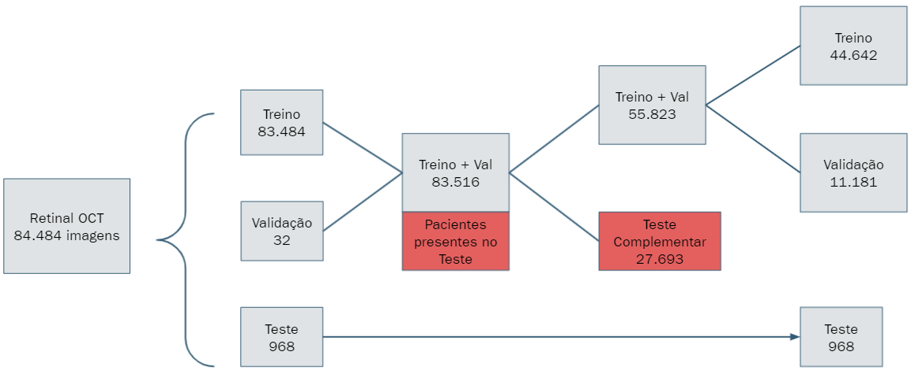
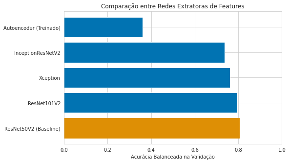
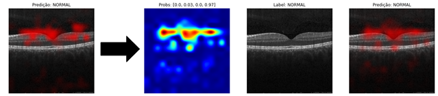

# Retinal OCT: classificação de doenças da retina com deep learning

Projeto final da disciplina INF-0619 do curso de extensão em **Mineração de Dados Complexos** do Instituto de Computação da Unicamp, entregue em julho de 2021 pelo **Grupo 9 – TURINGS**.

O objetivo é classificar imagens de tomografia de coerência óptica (OCT) da retina em quatro classes: neovascularização de coroide (CNV), edema macular diabético (DME), drusas (DRUSEN) e retina normal (NORMAL). O trabalho usa *transfer learning* com a ResNet50V2, e o resultado mais importante veio da análise dos dados: o dataset público mistura imagens de um mesmo paciente entre treino, validação e teste.

> **English summary.** Four-class classification of retinal OCT images (Kermany et al., 2018) with a frozen ResNet50V2 and a dense head. We found 546 patients shared between the public training and test splits, rebuilt a patient-wise split, used a perturbation-based class activation map to see where the network looks, and added border treatment and data augmentation. Notebooks, report and slides are in Portuguese.

## Destaques

1. **Vazamento de dados por paciente.** O nome de cada imagem traz o código do paciente. Ao cruzar os conjuntos, encontramos 546 pacientes do teste que também apareciam no treino ou na validação, com 27.693 imagens nesses dois conjuntos. Montamos uma **base honesta**, com pacientes distintos em cada conjunto, e reaproveitamos essas imagens como **teste complementar**. Na validação, a acurácia balanceada do baseline caiu de 88,8% para 80,3%: o modelo antigo também aprendia a reconhecer pacientes, não só doenças.
2. **Explicabilidade com Perturbation-CAM.** Implementamos um mapa de ativação por perturbação: a imagem é varrida em blocos, cada bloco é trocado por ruído várias vezes, e mede-se quanto a predição muda. Os mapas mostraram a rede olhando para bordas brancas e regiões escuras fora da retina.
3. **Modelo final.** Com base no que o CAM mostrou, as bordas brancas passaram a ser pretas e entrou aumentação de dados (rotação, translação, zoom e espelhamento). Na comparação de redes extratoras (ResNet101V2, Xception, InceptionResNetV2 e o encoder de um autoencoder), a ResNet50V2 seguiu como a melhor; a DenseNet201 também foi testada. Com uma camada densa de 100 neurônios, a acurácia balanceada na validação foi de 80,3% para 87,2%, e o CAM passou a se concentrar na retina.
4. **Avaliação honesta.** No teste, o baseline ainda teve acurácia balanceada um pouco maior. O modelo final acertou mais em CNV, DME e NORMAL no teste complementar, mas errou mais em DRUSEN. O ganho mais claro foi de interpretabilidade, não de acurácia.

<p align="center"></p>

## Resultados

Acurácia balanceada (média dos *recalls* das quatro classes):

| Modelo | Base | Conjunto | Acurácia balanceada |
|---|---|---|---|
| Baseline (ResNet50V2 + camada de saída) | original, com vazamento | validação | 88,8% |
| Baseline | honesta | validação | 80,3% |
| Modelo final (bordas + aumentação + camada de 100) | honesta | validação | 87,2% |
| Baseline | honesta | teste original (968 imagens) | 95,1% |
| Modelo final | honesta | teste original (968 imagens) | 93,9% |
| Baseline | honesta | teste complementar (27.693 imagens) | 87,5% |
| Modelo final | honesta | teste complementar (27.693 imagens) | 87,2% |

O teste original do dataset tem 242 imagens por classe. O teste complementar reúne as outras imagens dos mesmos pacientes do teste, que estavam no treino original. Nenhum dos dois tem pacientes em comum com o treino e a validação da base honesta. O complementar é 28 vezes maior e mantém o desbalanceamento natural das classes, por isso dá uma estimativa mais estável.

<p align="center">
  
  
</p>

## Estrutura

```text
notebooks/      pipeline principal, na ordem da entrega
  01_baseline_divisao_80_20.ipynb         exploração da base e baseline com a divisão 80/20
  02_baseline_sem_pacientes_do_teste.ipynb tira do treino/validação os pacientes do teste
  03_baseline_base_honesta_e_cam.ipynb    base honesta, baseline e Perturbation-CAM
  04a_autoencoder.ipynb                   encoder de um autoencoder como extrator
  04b–04e_outras_redes_*.ipynb            DenseNet201, InceptionResNetV2, ResNet101V2 e Xception
  04f_comparacao_redes.ipynb              gráfico comparativo das redes
  05_modelo_final.ipynb                   bordas, aumentação, ajuste da camada densa e CAM
experimentos/   notebooks exploratórios de cada integrante, antes da consolidação
app/            app web em Flask: predição e mapa do CAM para uma imagem enviada
modelos/        cabeça densa do modelo final e a normalização das features
dados/          divisão por paciente usada nos notebooks (treino, validação, teste e teste complementar)
docs/           relatório final (Markdown, com figuras) e apresentação final (PDF)
```

O experimento [`experimentos/alexandre_cruz/autoencoder_exploratorio.ipynb`](experimentos/alexandre_cruz/autoencoder_exploratorio.ipynb) usa as bibliotecas `Ale*`, de Alexandre Béo da Cruz, para avaliar um CatBoost treinado sobre as features do autoencoder: AUC, KS, ganho de informação e ponto de corte, em treino e validação. Uma versão mais recente delas está publicada em [tabular-ml-toolkit](https://github.com/alexandrebcruz/tabular-ml-toolkit).

## Como reproduzir

1. **Ambiente.** Os notebooks rodaram no Google Colab com GPU, em Python 3.7 e TensorFlow 2.5.
2. **Dados.** O dataset é o de [Kermany et al. (2018)](https://doi.org/10.17632/rscbjbr9sj.2), com licença CC BY 4.0. Os notebooks o baixam do Kaggle (`paultimothymooney/kermany2018`) com a sua chave da API, em `~/.kaggle/kaggle.json`. **Nunca versione esse arquivo**; o `.gitignore` já o bloqueia.
3. **Pasta de trabalho.** Os notebooks gravam artefatos numa pasta do Google Drive. Troque `/content/drive/My Drive/<PASTA_DO_PROJETO>/` pela sua pasta.
4. **Ordem.** Rode de `01` a `05`. O arquivo `dados/divisao_por_paciente.csv` traz a divisão exata usada do `03` em diante, com o conjunto de cada imagem e o código do paciente, para reproduzir os números sem refazer o sorteio.
5. **Modelo final pronto.** O extrator é a ResNet50V2 com os pesos da ImageNet, que o Keras baixa sozinho. A cabeça densa está em `modelos/modelo_final/` (`model_nn_tuned.json` e `weights_tuned.h5`), e as médias e desvios usados na normalização das 2.048 features estão em `normalizacao_nn.json`.

## App web

A pasta [`app/`](app/) tem o app em Flask que ficou no ar no Google App Engine em 2021. Ele recebe uma imagem de OCT e devolve as probabilidades das classes e o mapa do Perturbation-CAM. As instruções para rodar localmente estão em [`app/README.md`](app/README.md).

## Equipe

Grupo 9 – TURINGS:
- Alexandre Béo da Cruz
- Felipe Cesar Silva
- Fellipe Souto Sampaio
- Max Dias Saito
- Vinicius Nascimento Aguiar

## Referências

- Kermany, D. S. et al. (2018). Identifying Medical Diagnoses and Treatable Diseases by Image-Based Deep Learning. *Cell*, 172(5), 1122–1131. https://doi.org/10.1016/j.cell.2018.02.010
- Kermany, D.; Zhang, K.; Goldbaum, M. (2018). Labeled Optical Coherence Tomography (OCT) and Chest X-Ray Images for Classification. *Mendeley Data*. https://doi.org/10.17632/rscbjbr9sj.2
- Tsuji, T. et al. (2020). Classification of optical coherence tomography images using a capsule network. *BMC Ophthalmology*, 20, 114. https://doi.org/10.1186/s12886-020-01382-4
- Mahmood, A. et al. (2020). Automatic Hierarchical Classification of Kelps Using Deep Residual Features. *Sensors*, 20(2), 447. https://doi.org/10.3390/s20020447 (fonte da figura da arquitetura ResNet usada na apresentação)

## Sobre esta versão

Este repositório reúne e organiza, em 2026, o material do projeto de 2021. O código, os gráficos e os resultados são os originais. Nos notebooks foram retirados:
- links para pastas privadas;
- metadados do Colab, inclusive a conta de quem executou cada célula;
- anotações pessoais.

Também foram padronizados os caminhos do Google Drive e encurtadas saídas muito longas, como o log de descompactação do dataset.

O relatório foi convertido do Word para Markdown. Ficaram de fora o dataset, que deve ser baixado da fonte, os dados intermediários e os pesos grandes das redes de comparação (de 74 MB a 1 GB cada), além dos vídeos da apresentação. No app, o extrator passou a ser montado pelo Keras, sem o arquivo de 94 MB.

O repositório não tem licença de uso: os direitos são dos autores, e a leitura é livre. O dataset tem licença própria (CC BY 4.0).
