> Relatório final do projeto (versão v2, julho de 2021), convertido do Word para Markdown em 2026. O texto é o original; só foi corrigido o nome de um autor na capa. Um ponto a conferir: o texto cita 80,8% de acurácia balanceada do baseline na validação, mas o notebook [04f_comparacao_redes](../notebooks/04f_comparacao_redes.ipynb) e a apresentação registram 80,3%.

  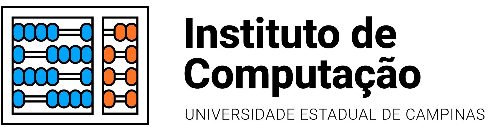
  

RETINAL OCT IMAGES

OPTICAL COHERENCE TOMOGRAPHY

Grupo 9 - TURINGS

Alexandre Béo da Cruz

Felipe Cesar Silva

Fellipe Souto Sampaio

Max Dias Saito

Vinicius Nascimento Aguiar

10 de julho de 2021

# Introdução

A tomografia de coerência óptica (OCT) é um exame médico capaz de representar imagens transversais da retina. Desta forma, os oftalmologistas podem diagnosticar doenças que não se apresentam em exames clínicos ou retinografia, como o edema macular diabético. Recentemente, foi demonstrado em Kermany et al 2018 que a classificação por meio de da técnica de *transfer learning* é capaz de alcançar resultados competitivos em relação a especialistas.

Neste contexto vamos exercitar os conceitos de análise, tratamento e modelagem de dados por meio da resolução do problema de reconhecimento de doenças oculares em imagens de tomografia de coerência óptica coletadas na pesquisa de Kermany.

# Análise Exploratória

O problema tratado é o de classificação multiclasse com desbalanceamento, contando com 4 classes distintas. As categorias existentes são retina normal (NORMAL), neovasculação da coróide (CNV), edema macular diabético (DME) e drusas oculares (DRUSEN). A base conta no total com 84.494 imagens, com maior proporção da doença CNV.

  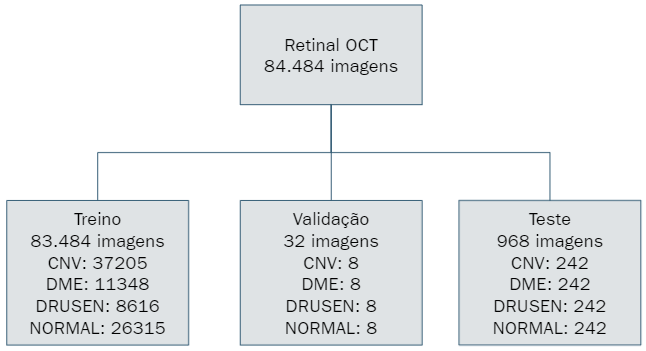

Figura 1: Divisão do dataset original

  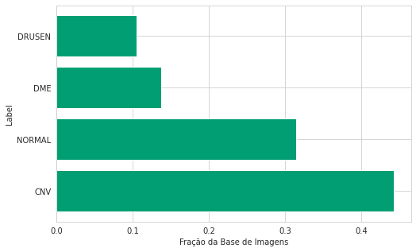

Figura 2: Distribuição das classes

Inicialmente foi realizada a inspeção visual dos dados onde verificou-se que se tratam de imagens em escala de cinza, sem formato definido, com diversas bordas e rotações, conforme a figura 3. Salienta-se que rotações e margens podem abrir espaço para o enviesamento do modelo, através da associação indireta entre um tipo de margem e o laboratório ou paciente.

  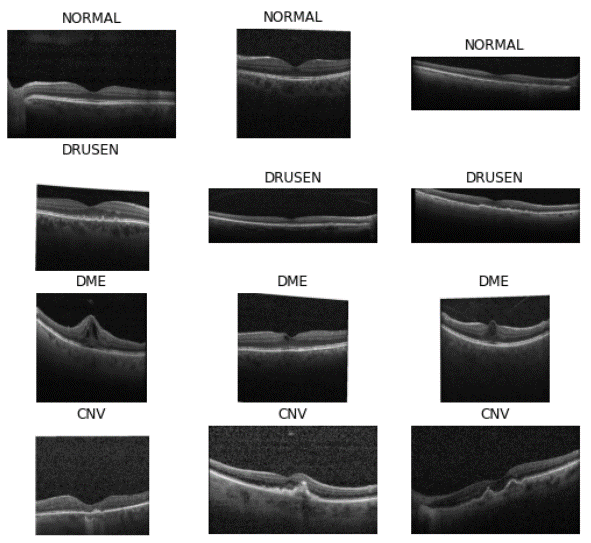

Figura 3: Exemplos de imagens de tomografia de coerência óptica e suas respectivas doenças, formatos, bordas e rotações.

No que tange ao formato das imagens, identifica-se diferentes padrões distribuídos de forma aleatória ao longo dos conjuntos, conforme pode ser visto na figura 4:

  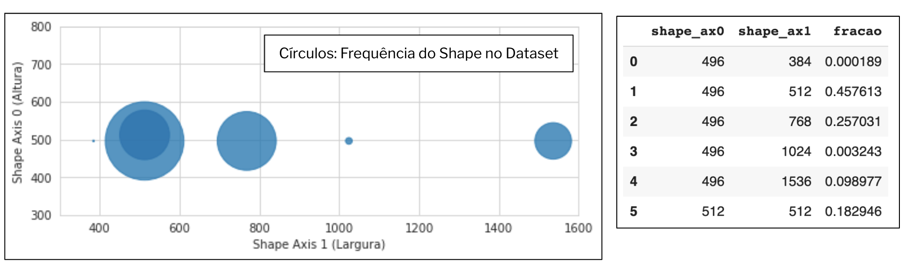

Figura 4: Diferentes resoluções das imagens e suas distribuições

Por fim, as imagens trazem consigo a identificação do paciente ao qual as mesmas pertencem. Analisando esta informação notou-se uma distribuição bastante desbalanceada em relação à quantidade de imagens por paciente. Enquanto uma quantidade significativa de pacientes possuem menos de 50 imagens, existem casos de indivíduos com até 800 imagens.

  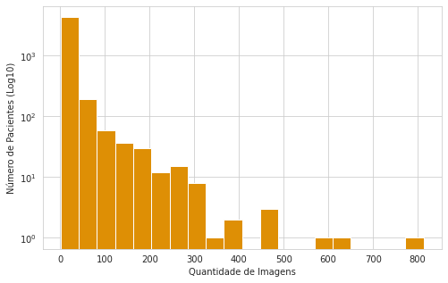

Figura 5: Diferentes resoluções das imagens e suas distribuições

Mas o dado mais relevante mesmo ficou por conta da existência de diversos pacientes simultaneamente nos conjuntos de treino, validação e testes. Este *data leakage* é de extrema importância no aprendizado de máquina e será abordado separadamente ao longo deste trabalho.

# Tratamento dos Dados

Considerando as características das imagens e as condições de entrada da rede neural proposta como baseline, definiu-se pela padronização das imagens no formato 512×512, a conversão para 3 canais de cores e a normalização dos tons de cinza para o intervalo[0,1].

  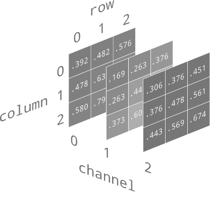
  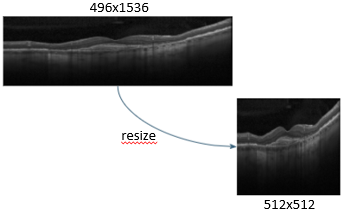

Figura 6: Pré-tratamento das imagens

Além do tratamento individual das imagens, a separação treino/validação também foi considerada inadequada devido à baixíssima quantidade de amostras no conjunto de validação. Os dois conjuntos foram então unidos e uma nova divisão na proporção 80/20 foi aplicada, assegurando a manutenção do desbalanceamento original entre as classes.

  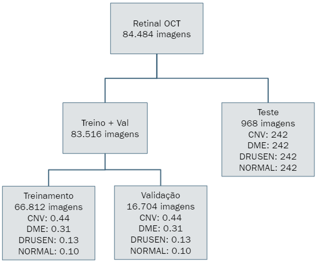

Figura 7: Nova separação dos conjuntos treino e validação

# Modelo Base

Utilizando-se da técnica de *transfer learning*, foi desenvolvido um modelo base com uma rede neural convolucional, a ResNet50V2, com camadas congeladas e pesos pré-treinados da ImageNet. Sua camada totalmente conectada original de 1000 neurônios foi naturalmente substituída por uma nova camada representativa do problema de 4 classes avaliado. Demais parâmetros foram ativação Softmax, otimizador Adam com taxa de aprendizado de 0.001 e a entropia cruzada categórica como função de custo. Uma visualização gráfica da rede pode ser vista na figura 8:

  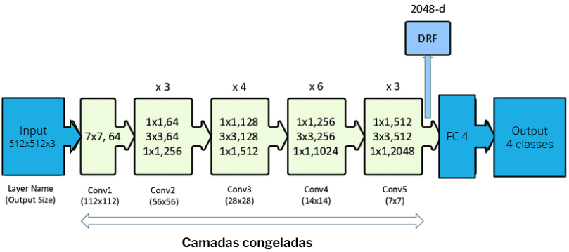

Figura 8: Arquitetura ResNet50V2 adaptada

A otimização foi realizada com pesos associados a cada classe, a fim de considerar o desbalanceamento entre as classes. A figura 9 apresenta a matriz de confusão no treino e validação para o modelo baseline, assim como as suas acurácias balanceadas.

  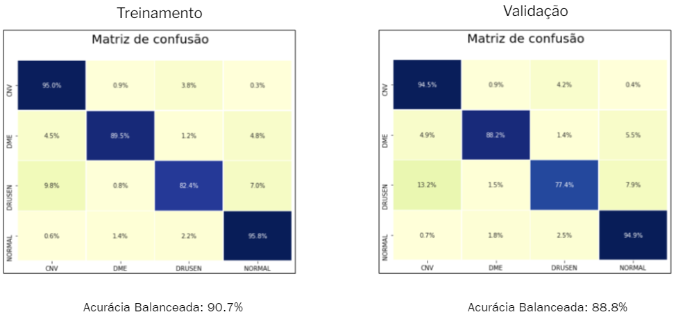

Figura 9: Matrix de confusão para o modelo baseline

# Base Honesta

Conforme já mencionado anteriormente, imagens de um mesmo paciente encontram-se distribuídas nos conjuntos de treino, validação e testes, o que configura um potencial problema de data leakage, já que o modelo pode “aprender” os padrões da retina dos indivíduos e não somente as características das doenças, que é o que se busca.

Para corrigir esta inadequação do dataset os pacientes foram identificados e aqueles presentes no conjunto de treino tiveram suas imagens removidas dos conjuntos de treino e validação. A quantidade de pacientes nessa situação era significativa, 546 indivíduos, e mais significativa ainda foi a quantidade de imagens que tiveram que ser removidas, um total de 27.693. Esta tratativa foi considerada aceitável devido ao fato de ainda restarem no conjunto de treino/validação mais de 55 mil imagens, o que ainda permitiria um bom treinamento. Para que dados de mais de 27 mil observações não fossem simplesmente descartados, criou-se um conjunto complementar de imagens para serem utilizadas como teste. A figura 10 esquematiza o que foi feito.

Com a nova base limpa, o modelo baseline foi treinado novamente e a sua performance reavaliada em treino e validação. Na figura 11 apresentamos esses resultados através das matrizes de confusão. Os novos resultados mostram uma queda na acurácia de validação em geral, com uma significativa perda de performance para a classe DRUSEN. Esta diferença pode confirmar o viés do modelo anterior em aprender padrões particulares de pacientes, tendo mais dificuldade de identificar uma doença específica. É necessário portanto tentar compreender as razões por trás dessa dificuldade e eventualmente melhorar a performance do modelo.

  

Figura 10: Criação de uma base de dados “honesta”, assegurando a ausência de data leakage.

  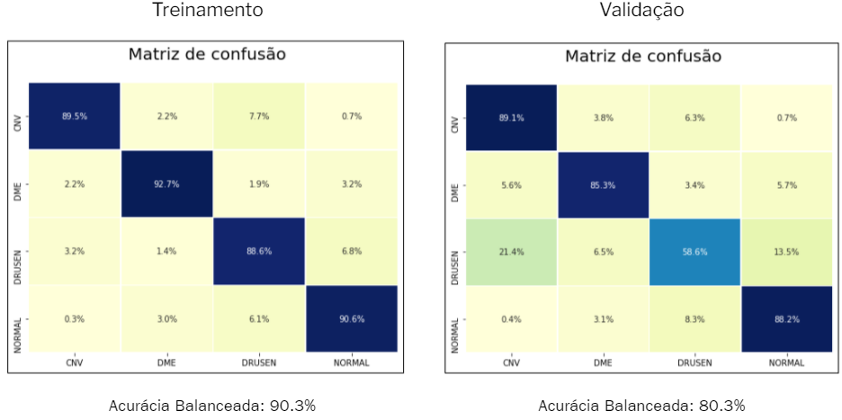

Figura 11: Matriz de confusão para o modelo baseline, considerando uma base “honesta”.

# Explicabilidade

Buscando ter uma explicabilidade do que a rede está observando para fazer a classificação, utilizou-se um algoritmo de Activation Mapping ou como é popularmente conhecido, CAM. Esta técnica busca explicações visuais para modelos baseados em CNN. Ao implementar o algoritmo e aplicá-lo ao modelo baseline, algumas importantes informações puderam ser obtidas.

Na figura 12 temos um exemplo do comportamento esperado pela rede: na imagem de uma retina com label NORMAL, observamos que o algoritmo CAM registrou regiões próximas e na borda da retina para efetuar a classificação.

  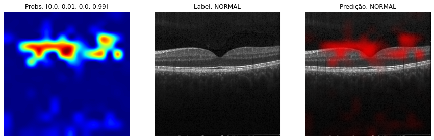

Figura 12: Comportamento adequado da rede, com as regiões relevantes sendo parte da retina.

Para outros casos, porém, nos deparamos com resultados menos coerentes. Na figura 13, por exemplo, observamos a rede tendendo a considerar a borda da imagem, desviando do seu foco principal de avaliar a região da retina.

  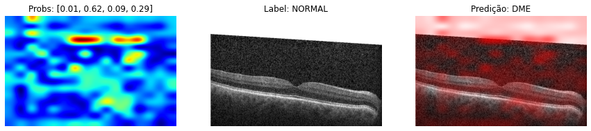

Figura 13: Regiões de borda da imagem sendo inadequadamente consideradas pela rede.

Já na figura 14, observa-se que a rede considera somente um ponto na área escura da imagem onde não há qualquer presença da retina. O fato da imagem se apresentar significativamente rotacionada poderia ser um potencial fator de influência neste comportamento inadequado da rede.

  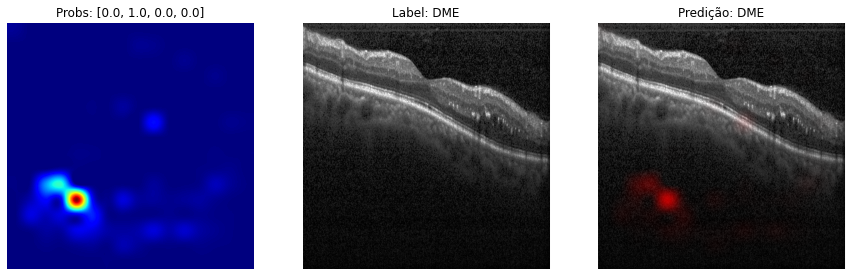

Figura 14: Imagem rotacionada e a rede desviando da retina

# Modelo Final

Os resultados obtidos com o algoritmo de CAM no modelo baseline motiva a adição de duas novas abordagens no tratamento de dados. A primeira delas é o tratamento das imagens para eliminar as bordas brancas quando houver e transformá-las em bordas pretas, de modo que tenham uma influência menor no aprendizado dos algoritmos. A outra é utilizar técnicas de aumentação de dados (*Data Augmentation*) para incluir rotações, translações, zooms e reflexões nas imagens para treinamento e validação, para que o aprendizado seja robusto a essas transformações. Com a aumentação de dados, nossa base de dados para treino e validação foi aumentada em cinoc vezes, incluindo agora essas transformações. A Figura 15 ilustra as transformações utilizadas.

  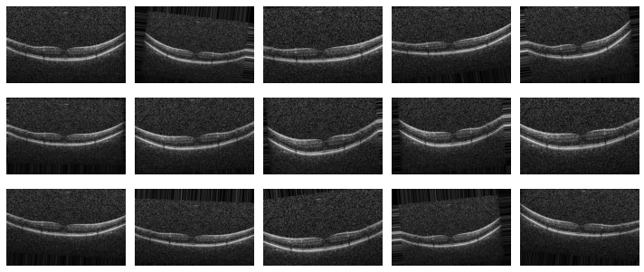

Figura 15 - Exemplo das transformações aplicadas a uma imagem do dataset

Como uma estratégia adicional, comparamos o desempenho do modelo quando alteramos a rede extratora de features, utilizando outras redes pré-treinadas e também uma rede encoder obtida de um autoencoder treinado com este dataset. Nesses experimentos não utilizamos a aumentação de dados devido ao tempo necessário para realizar o treinamento com o dataset aumentado. A Figura 16 mostra a Acurácia Balanceada obtida em cada uma das redes extratoras de features que foram experimentadas, em que podemos ver que a ResNet50V2, que já era a rede usada no baseline, foi a que obteve a melhor performance na validação.

  

Figura 16 - Desempenho das Redes Extratoras de Features Experimentadas

Com a rede extratora de features e as transformações para a aumentação de dados definidas, buscamos novas arquiteturas para a rede Fully-Connected e novos hiperparâmetros de treinamento de modo a maximizar a Acurácia Balanceada na base de validação. Dessa forma chegamos a configuração de uma rede com 100 neurônios em uma camada escondida e 4 neurônios na camada de saída respectivos às 4 classes do problema. A Figura 17 mostra a curva de viés-variância do treinamento dessa rede para um otimizador SGD com learning rate de 0.0001.

  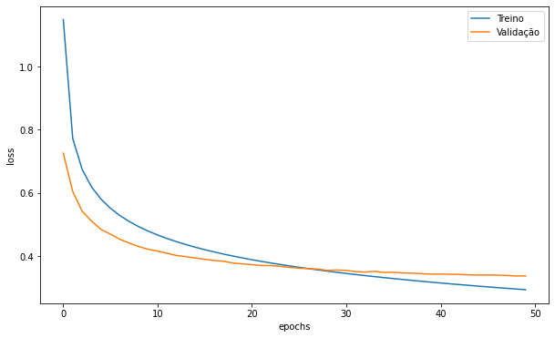

Figura 17 - Curva de viés-variância para o treinamento do Modelo Final

Nesse modelo Final, a acurácia balanceada na validação que antes era de 80.8% no baseline agora é 87.2%, como mostra a Figura 18 com as matrizes de confusão do modelo treinado. É importante notar que a classe DRUSEN continua sendo a classe com pior poder de classificação.

  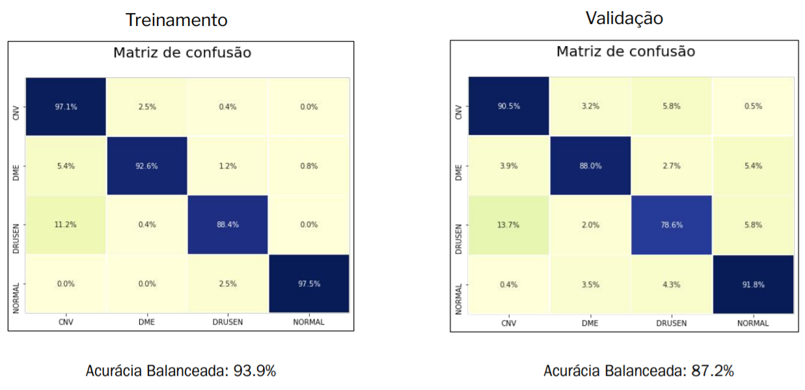

Figura 18 - Matriz de confusão do modelo final treinado no conjunto de treino e validação

Ao aplicarmos o CAM no modelo final, utilizamos as mesmas observações mostradas anteriormente no baseline para comparar se os ajustes foram efetivos e ajudaram a melhorar o aprendizado da rede.

Na figura 19 é possível observar o heatmap apresentado pelo CAM no modelo baseline, mais à esquerda, seguido dos resultados obtidos após os novos pré-tratamentos e treino do modelo final. Nota-se a evolução com as zonas de calor mais próximas à retina e à sua curvatura.

  

Figura 19 – Evolução do aprendizado da rede através da visualização por CAM

Na figura 20 a evolução se deu com as zonas de calor se transferindo das bordas para regiões mais próximas da retina após os tratamentos.

  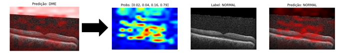

Figura 20 – Evolução do aprendizado da rede através da visualização por CAM

Por fim, na figura 21 observa-se que a zona de calor não está mais concentrada em um ponto específico da região escura da tomografia e passa a observar mais pontos e principalmente as curvas na retina.

  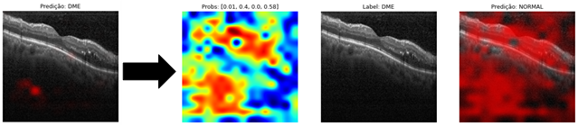

Figura 21 – Evolução do aprendizado da rede através da visualização por CAM

Com o modelo baseline e o modelo final treinados, comparamos os desempenhos nos conjuntos de teste original e complementar. A Figura 22 mostra o desempenho dos dois modelos para o primeiro conjunto e a Figura 23 o desempenho considerando o segundo conjunto.

Analisando a acurácia balanceada, verifica-se que o modelo baseline tem desempenho melhor tanto no teste original quanto no complementar. Porém, analisando a diagonal das matrizes de confusão no teste complementar, vemos que o modelo final tem um poder de classificação superior ao baseline em todas as classes com exceção da DRUSEN. Nota-se também pela matriz de confusão que esta classe é mais frequentemente confundida com a classe CNV, seguida da classe NORMAL.

  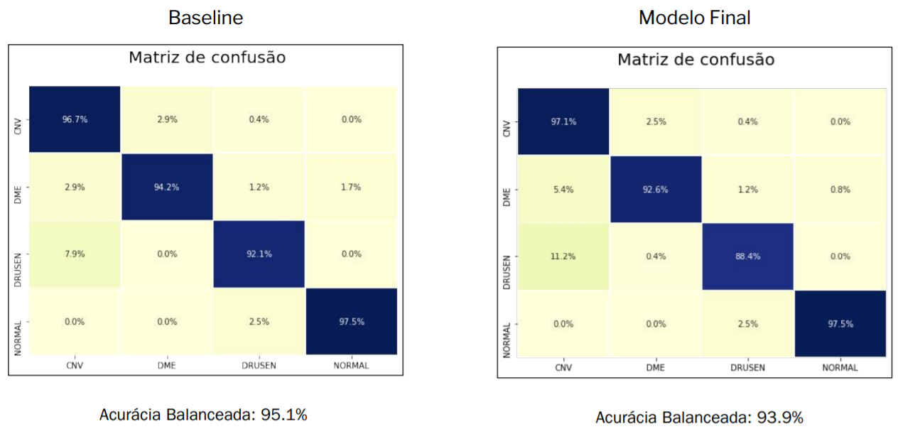

Figura 22 - Matriz de Confusão do baseline e do modelo final no conjunto de teste

  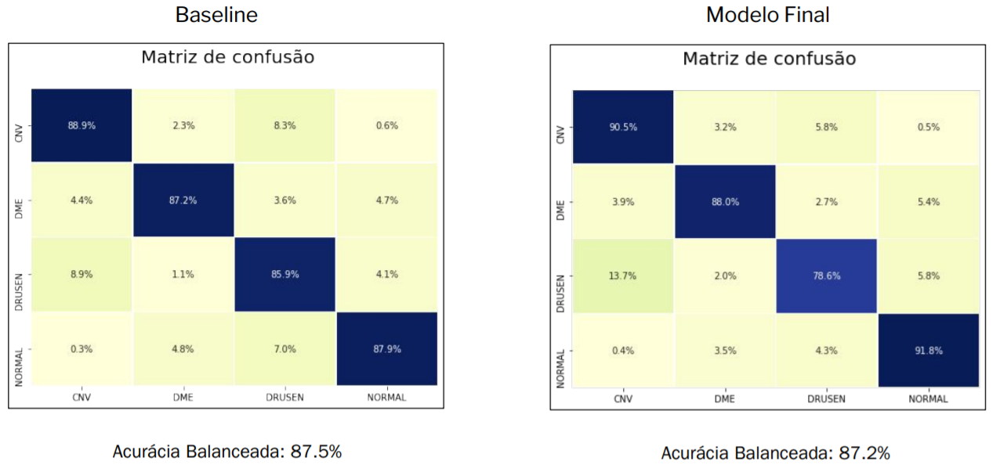

Figura 23 - Matriz de Confusão do baseline e do modelo final no conjunto de teste complementar

# Conclusões

Por fim, apesar dos desafios inerentes do problema de reconhecimento de doenças em tomografias de coerência óptica, como a existência de bordas e rotações, notamos que houve ganho na interpretabilidade no modelo final. É possível observar que este modelo, baseado na mesma rede neural convolucional utilizada no baseline, adquiriu maior capacidade de reconhecimento de doenças ao focar sua tomada de decisão em regiões de interesse próximas à retina. Esta mudança ocorreu em parte pelo tratamento das bordas brancas e aumento de dados. Notamos também que o tratamento adotado para o problema de data leakage permite uma melhor comparação com resultados de especialistas em doenças oculares, bem como uma maior robustez e confiabilidade dos resultados.

Em relação ao reconhecimento de doenças específicas, o modelo final mostrou resultados marginalmente superiores na maioria das classes, exceto na classe DRUSEN. Conjectura-se que existem interseções entre os pacientes pertencentes a esta classe e as demais. E em uma análise adicional observou-se a presença de muitos pacientes que possuem em seu prontuário o registro de múltiplas doenças. Fazendo uma avaliação da associação comum entre doenças, mostrada na figura 24, observou-se uma quantidade significativa desses pacientes que supostamente apresentariam DRUSEN e CNV ou DRUSEN e NORMAL simultaneamente.

  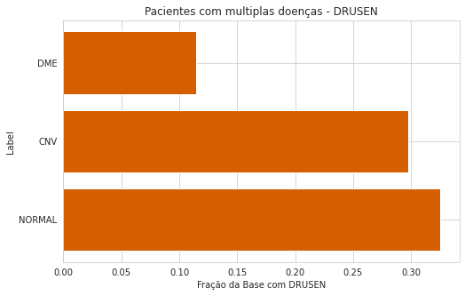

Figura 24 - Fração de pacientes na base com a label DRUSEN que também possuem outras labels

Assumindo que os rótulos estejam corretos e que é realmente possível haver tais condições clínicas, essas observações podem explicar a tendência do modelo de se confundir entre as essas classes e justificar a menor performance. Sugere-se assim, como passos futuros, um melhor entendimento clínico do problema e uma análise mais profunda tanto sobre o dataset quanto sobre a relação geométrica, visual e matemática entre as múltiplas classes, com foco específico na DRUSEN.
